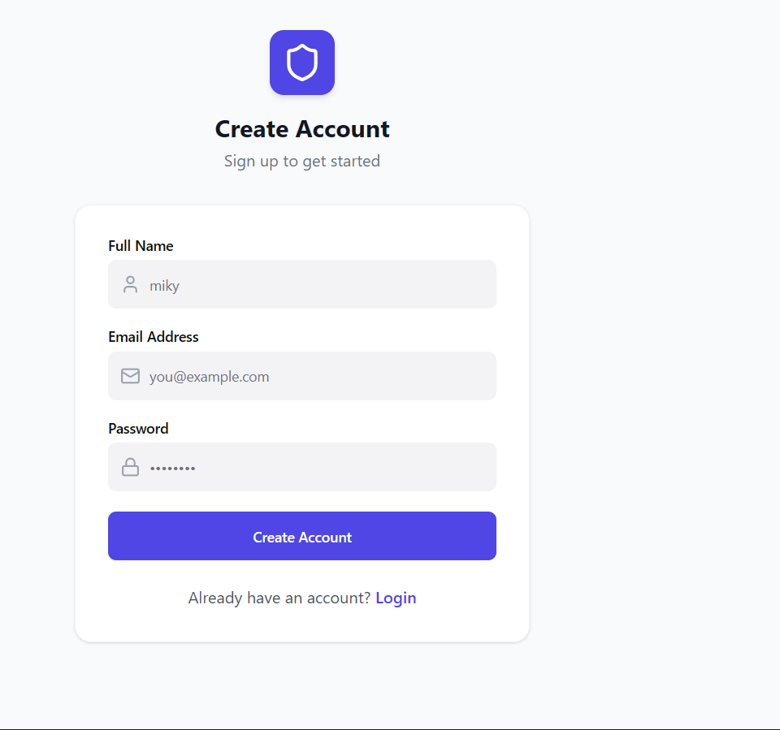
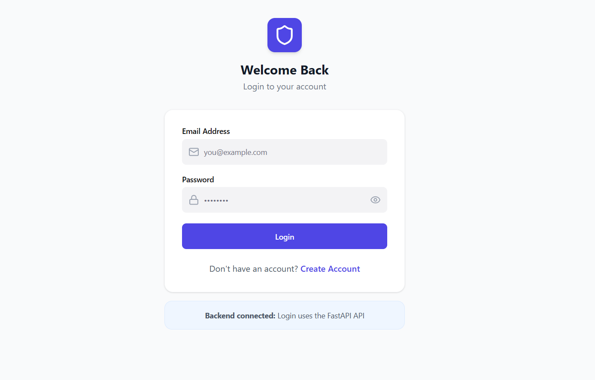

# 🔐 Authentication System

 A complete **full-stack authentication system** built with **FastAPI** (Python) backend and **React + Vite** frontend. Features secure user registration, JWT authentication with refresh tokens, protected routes, and account management.

Full-stack authentication system with a FastAPI backend and Vite frontend.

## Live Deployment

- Frontend (Vercel): https://authentication-system-flax.vercel.app
- Backend (Render): https://authentication-system-jzfa.onrender.com
- Health Check: https://authentication-system-jzfa.onrender.com/health

## Live Demo

- Frontend (Vercel): https://authentication-system-flax.vercel.app


## 📸 Screenshots

### Create Account Page


### Login Page

## ✨ Features

- Secure user registration with **bcrypt** password hashing
- JWT Access Token + Refresh Token authentication
- Protected `/me` profile endpoint
- Secure account deletion
- Refresh token rotation
- Rate limiting on login (prevents brute-force attacks)
- Request logging middleware
- CORS configured for frontend
- SQLite database with SQLAlchemy
-  Automatic Swagger UI & ReDoc documentation
- User registration with password hashing
- JWT access token login
- Refresh token flow
- Protected profile endpoint (`/me`)
- Account deletion endpoint
- Email verification code flow (demo mode)
- Rate limiting on sensitive endpoints
- Request logging middleware

## Architecture

- Frontend is deployed on Vercel (`frontend/`)
- Backend API is deployed on Render (`backend/`)
- Frontend calls backend using `VITE_API_URL`
- Backend allows frontend origin through `CORS_ORIGINS`
- Database is SQLite (`auth_db.sqlite`) managed by the backend service

## 🛠️ Tech Stack

**Backend:** FastAPI, SQLAlchemy, python-jose, passlib[bcrypt], SlowAPI  
**Frontend:** React + Vite

## Architecture

- Frontend is deployed on Vercel (`frontend/`)
- Backend API is deployed on Render (`backend/`)
- Frontend calls backend using `VITE_API_URL`
- Backend allows frontend origin through `CORS_ORIGINS`
- Database is SQLite (`auth_db.sqlite`) managed by the backend service

- FastAPI
- SQLAlchemy
- SQLite
- python-jose (JWT)
- passlib[bcrypt]
- React + Vite

## Project Structure

- `backend/` - FastAPI app, models, schemas, and security utilities
- `frontend/` - Vite React app

## Local Development

### Backend

```bash
pip install -r backend/requirements.txt
uvicorn backend.main:app --reload
```

### Frontend

```bash
cd frontend
npm install
npm run dev
```

## Environment Variables

### Backend (`.env`)

- `SECRET_KEY` - JWT signing secret
- `ALGORITHM` - JWT algorithm (default: `HS256`)
- `ACCESS_TOKEN_EXPIRE_MINUTES` - access token expiry (default: `30`)
- `REFRESH_TOKEN_EXPIRE_DAYS` - refresh token expiry (default: `7`)
- `CORS_ORIGINS` - comma-separated allowed origins
- `LOGIN_RATE_LIMIT` - login attempts per window (default: `5`)
- `LOGIN_RATE_LIMIT_WINDOW_SECONDS` - login window in seconds (default: `60`)
- `SEND_CODE_RATE_LIMIT` - send-code attempts per window (default: `3`)
- `SEND_CODE_RATE_LIMIT_WINDOW_SECONDS` - send-code window in seconds (default: `300`)

Example:

```env
SECRET_KEY=replace-with-a-long-random-secret
ALGORITHM=HS256
ACCESS_TOKEN_EXPIRE_MINUTES=30
REFRESH_TOKEN_EXPIRE_DAYS=7
CORS_ORIGINS=https://authentication-system-flax.vercel.app,http://localhost:5173,http://127.0.0.1:5173
```

### Frontend (Vercel Environment Variable)

- `VITE_API_URL` - backend base URL

Example:

```env
VITE_API_URL=https://authentication-system-jzfa.onrender.com
```

## Deployment

### Backend on Render (Web Service)

- Root Directory: `backend`
- Build Command: `pip install -r requirements.txt`
- Start Command: `bash start.sh`

### Frontend on Vercel

- Root Directory: `frontend`
- Build Command: `npm run build`
- Output Directory: `dist`
- Routing file: `frontend/vercel.json`

## API Endpoints

- `GET /health`
- `POST /register`
- `POST /login`
- `POST /refresh`
- `GET /me`
- `DELETE /delete-account`
- `POST /send-code`
- `POST /verify`

## Production Notes

- Passwords are hashed and never stored in plain text.
- Keep `SECRET_KEY` private and rotate it when needed.
- SQLite on a cloud web service is suitable for demos, but for long-term production use a managed database (for example, PostgreSQL).

## Error Handling

- `400` invalid credentials, duplicate email, invalid verification code
- `401` invalid or missing token
- `404` user not found

## Notes

- Passwords are never stored in plain text.
- For local development, keep the backend running on `http://127.0.0.1:8000` and the frontend on `http://127.0.0.1:5173`.
